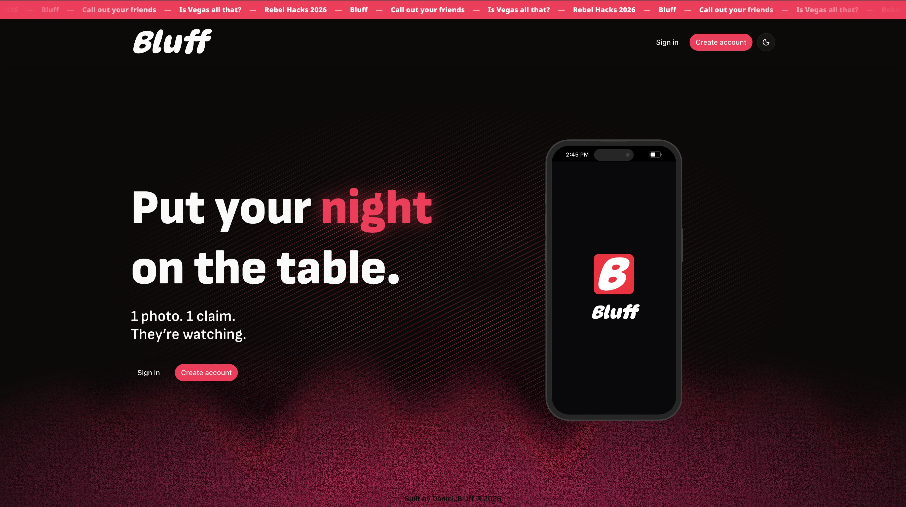

# Bluff

### A daily photo-bluffing game with friends



## Built with


Bluff is a social photo game built around daily prompts. Post a photo, decide whether
your claim is the truth or a bluff, and let your friends put chips on their read. When
the round closes, the answer is revealed and the bets settle automatically.

> Built for UNLV's [Rebel Hacks 2026](https://rebelhacks.com/). The theme was Las Vegas, and a game about
> calling bluffs felt like the right way to poke at the idea that Vegas isn't
> all it's cracked up to be.

## How it works

1. A new prompt opens for the day.
2. Players answer with a photo, a caption, and a hidden Truth or Bluff choice.
3. Friends swipe or vote, wager chips, react, and leave threaded comments.
4. The round reveals automatically and pays out correct reads and successful bluffs.
5. Profiles and personal history keep track of posts, friends, chips, and results.

## Features

- Global and friends-only feeds with paginated past rounds
- Scheduled posting, voting, reveal, and settlement phases
- Photo uploads, clipboard paste, reactions, and threaded comments
- Chip wagers and automatic payouts
- Public profiles, friend requests, post grids, and transaction history
- Responsive desktop panels and mobile drawers
- Animated landing-page demo with reduced-motion support

## Development

```bash
git clone https://github.com/MamuzaD/bluff.git
cd bluff
pnpm install
pnpm exec convex dev   # in one terminal, starts/connects Convex
pnpm dev               # in another, runs the app at http://localhost:3000
```

Add your Clerk publishable key to `.env.local`, then in Clerk create a JWT template
for Convex and set its issuer URL as `CLERK_JWT_ISSUER_DOMAIN` in the Convex dashboard.
Required env vars are validated on startup in `src/env.ts`.
